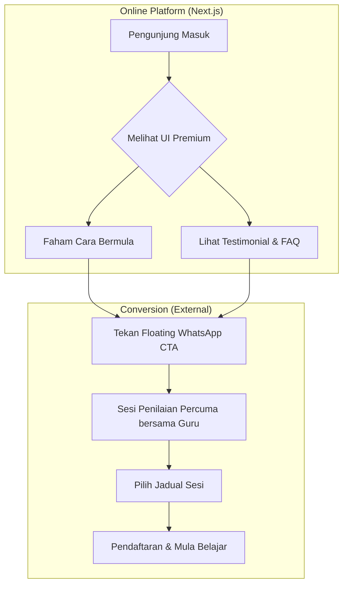

# 📖 OIqra: Pendidikan Al-Quran Premium 100% Online


> **"Pendidikan Al-Quran Premium Rangkaian Digital — Di mana tradisi bertemu teknologi."**

OIqra adalah platform pembelajaran Al-Quran dan Iqra bertaraf premium yang menggunakan kaedah **Talaqqi Musyafahah** (bersemuka digital) secara 100% atas talian. Direka khusus untuk pelajar berumur 7-17 tahun, sistem ini menggabungkan kepakaran Guru Hafiz Bersanad dengan antaramuka web yang moden dan responsif.

---

## 🏗️ Projek Arsitektur & Teknologi

Laman web ini dibangunkan menggunakan teknologi web terkini untuk memastikan kelajuan, keselamatan, dan pengalaman pengguna (UX) yang luar biasa, menjustifikasikan nilai tinggi bagi setiap sesi pembelajaran.

### 🛠️ Core Tech Stack

- **Framework:** [Next.js 15 (App Router)](https://nextjs.org/) - Untuk SEO yang mantap dan prestasi *server-side rendering* yang pantas.
- **Styling:** [Tailwind CSS v4](https://tailwindcss.com/) - Sistem reka bentuk utiliti yang memudahkan kawalan visual yang tepat.
- **Animations:** [Framer Motion](https://www.framer.com/motion/) - Digunakan untuk animasi *scroll-triggered* dan transisi yang halus.
- **Icons:** [Lucide-React](https://lucide.dev/) - Set ikon SVG yang tajam dan konsisten.
- **Runtime/Package Manager:** [Bun](https://bun.sh/) - Untuk pemasangan dependensi dan masa pembangunan yang paling pantas.

---

## 🗺️ User Journey (Perjalanan Pengguna)

Sistem ini direka untuk menukarkan pengunjung kepada pelajar berdaftar dengan geseran (friction) minimum.



---

## ✨ Ciri-Ciri Utama Sistem

### 1. **Premium Aesthetic Overhaul**
- **Soft Blue Design System:** Menggunakan palet biru langit (`sky-500`) dan emas (`amber-400`) untuk membina suasana ketenangan dan kualiti.
- **Glassmorphism Navigation:** Bar navigasi yang lutsinar dan berubah menjadi kesan kaca kabur (*blurred glass*) apabila pengguna skrol ke bawah.

### 2. **Animated Interactive Sections**
- **Smooth Scroll Transitions:** Setiap elemen (kad, teks, imej) muncul dengan kesan *fade-up* menggunakan Framer Motion.
- **Interactive FAQ:** Akordion soalan lazim yang membantu menjawab keraguan ibubapa secara langsung di laman web.

### 3. **Conversion Focused UX**
- **Floating WhatsApp Button:** Butang WhatsApp dengan kesan denyutan (*pulse animation*) yang sentiasa mudah dicapai di sudut bawah skrin.
- **Mobile First Responsive:** Dioptimumkan sepenuhnya untuk telefon bimbit, memandangkan kebanyakan ibubapa mengakses maklumat melalui peranti mudah alih.

---

## 📂 Struktur Direktori

```bash
OIqra/
├── public/                # Aset statik (Imej, Logo, Background)
│   └── assets/            # Gambar Model Founder & Pelajar
├── src/
│   └── app/               # Next.js App Router (Logic & Routing)
│       ├── layout.tsx     # Tetapan Font & Metadata Global
│       ├── globals.css    # Tailwind Utility Mixins & Theme
│       └── page.tsx       # Komponen Utama (Single Page App)
├── README.md              # Dokumentasi ini
└── next.config.ts         # Konfigurasi Next.js
```

---

## 🚀 Panduan Pembangunan (Development)

Pastikan anda mempunyai **Bun** terpasang di sistem anda.

1. **Klon Repositori:**
   ```bash
   git clone https://github.com/oiqra-kl/OIqra.git
   ```

2. **Pasang Dependensi:**
   ```bash
   bun install
   ```

3. **Jalankan Seder Peranti (Local Dev):**
   ```bash
   bun dev
   ```
   Buka [http://localhost:3000](http://localhost:3000) untuk melihat laman web.

---

## ☁️ Deployment (Pelancaran)

Projek ini telah sedia untuk dikerahkan ke **Vercel** dengan sekali klik. Kerana ia berasaskan Next.js, Vercel akan mengesan semua konfigurasi secara automatik dan menyediakan hosting yang selamat (SSL) dan pantas secara percuma untuk skala permulaan.

---

## 📜 Kredit & Pemilikan

- **Pengasas:** Ustaz Naufal & Ustaz Amirul Amri.
- **Pembangunan Web:** Dibangunkan dengan penuh perhatian terhadap perincian untuk kualiti premium.

> *"Membangunkan generasi mahir tajwid dari keselesaan rumah anda."*
